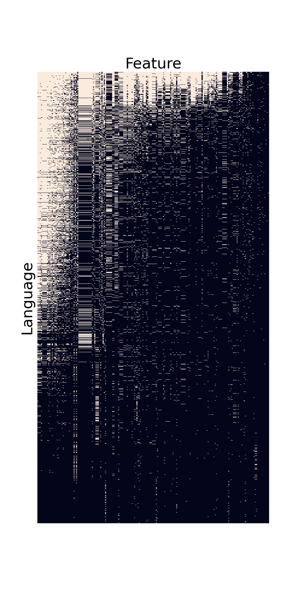

# SILS

SILS (Statistical Investigation of Language Structures) is a project
to apply machine learning methods to the [WALS dataset](https://wals.info/).
WALS compiles features of the world's languages from various published
grammars, showing how languages vary and the common patterns
found across many different languages.

This was my final project for [Lighthouse Labs](https://www.lighthouselabs.ca/en/).

## Background

The world's languages are quite diverse, but they aren't random;
certain language features are much more common than others,
and certain combinations of features tend to occur together.
This suggests that there are universal forces shaping languages,
either because of the way the human brain works, or because of
the practical needs of a communication system.

I've done two analyses on the WALS dataset to gain insight into these forces:

- Using hierarchical clustering to look for "parameters" that
  control multiple features at once.
- Using linear models to control for the historical and
  geographical relationships between languages and reveal the underlying tendencies.

## Data Preprocessing

The biggest challenge in using the WALS dataset is that it's very sparse.
While the dataset lists over 2,000 languages and 192 language features,
most of these languages are poorly documented and lack values for most
features. So I had to narrow my focus to the best documented languages
and features.

The whole dataset looks like this:

## Parameters

Noam Chomsky proposed that languages can be described
by a list of *parameters*, like switches that can be either
on or off, and these parameters control many of the
language's features. For example, languages can be
either "head-final" or "head-initial", and this single
switch affects verb placement, adjective placement, prepositions,
etc. Could I find evidence of this by clustering
languages by their features?

## 
