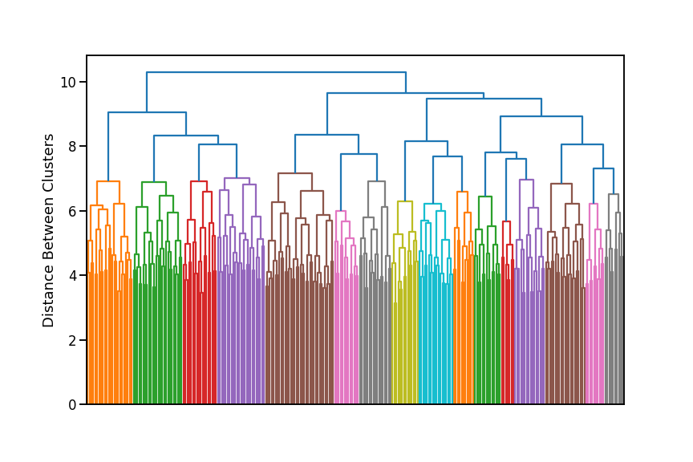
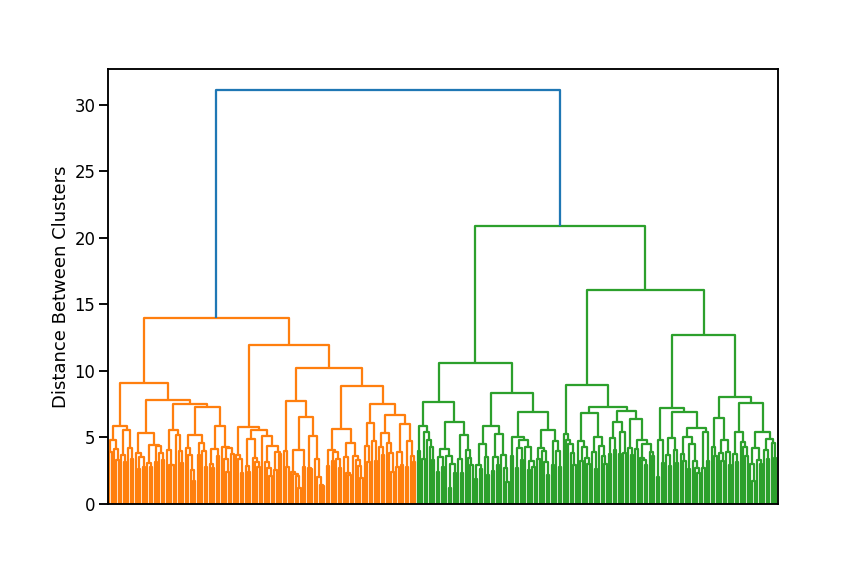
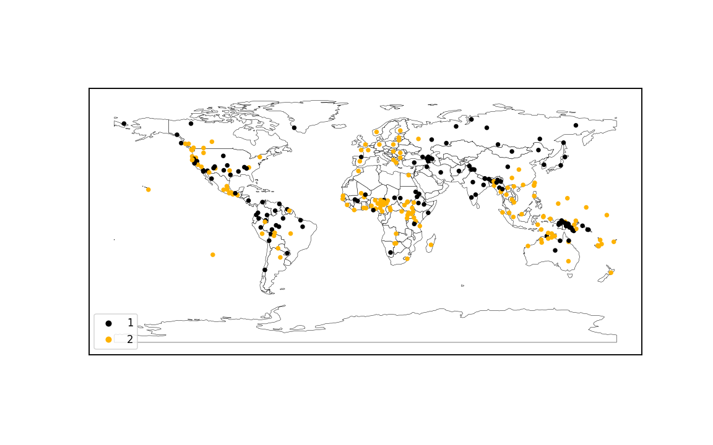

# SILS

SILS (Statistical Investigation of Language Structures) is a project
to apply machine learning methods to the [WALS dataset](https://wals.info/).
WALS compiles features of the world's languages from various published
grammars, showing how languages vary and the common patterns
found across many different languages.

This was my final project for [Lighthouse Labs](https://www.lighthouselabs.ca/en/).

## Overview

The world's languages are quite diverse, but they aren't random;
certain language features are much more common than others,
and certain combinations of features tend to occur together.
This suggests that there are universal forces shaping languages,
either because of the way the human brain works, or because of
the practical needs of a communication system.

I've done two analyses on the WALS dataset to gain insight into these forces:

- Using hierarchical clustering to look for "parameters" that
  control multiple features at once.
- Using linear models to control for the historical and
  geographical relationships between languages and reveal the underlying tendencies,
  i.e. how common we would expect a feature to be in a collection of totally
  independent languages.

These are the main takeaways from these analyses:

- The world's languages naturally cluster into two groups based on
  whether they tend to put the most important word (the "head") in a phrase
  at the beginning or the end of the phrase. This corresponds to the known
  classification of languages into "head-initial" and "head-final".
- The inferred underlying tendency towards certain features is quite different
  from the raw proportions. For example, *labial-velar* sounds (pronouncing
  a "k" and "p" or a "g" and "b" at the same time) occur in 6% of
  my sample, but the languages that have it are clustered in one region
  in sub-Saharan Africa and likely got it from a common source. My
  analysis implies that, in a collection of totally independent languages,
  labial-velar sounds would arise in only about 1% of them.

## Data Preprocessing

Data preparation is in ``prep.ipynb``.

### Choosing a Sample

The biggest challenge in using the WALS dataset is that it's very sparse.
While the dataset lists over 2,000 languages and 192 language features,
most of these languages are poorly documented and lack values for most
features. So I had to narrow my focus to the best documented languages
and features.

The whole dataset looks like this:

A language has a given feature documented in WALS only if its point is tan in this
plot. The black is all the missing data. Fortunately, the sparsity isn't random;
some languages are very well documented and have most of the features filled in,
while some features are commonly mentioned in the literature and have values filled in
for most languages. So I chose a sample of the best-documented languages and
restricted my analysis to the best-documented features.

The easiest way to do this is to keep only the M best languages and the
N best features, choosing M and N to achieve the desired density.
The problem is that some languages are "anomalously documented", in that
they have values for many poorly documented features but lack values
for many well-documented features. This means M and N have to be very
small to get a good enough density.

Instead, I iteratively eliminated the worst-documented feature and then
the two worst-documented languages, re-sorting the rows and columns by
density after every iteration, and continuing until a certain density
threshold was met. That way, "anomalously documented" languages
lose most of their features in the early iterations, and then are eliminated
themselves. After trying various thresholds, I settled on a sample
of 280 languages and 40 features. This is what the sample looks like:

This sample has a density of 95%, leaving the remaining 5% to be imputed.
This is much better than the naive approach of simply choosing the
best-documented 280 languages and 40 features independently of each
other, which only leads to an 85% density.

The resulting languages are still a good representation of the diversity
of the world's languages. Here they are on the map:

Note that each dot indicates the language's place of *origin*,
not the current extent of its speaker population. For example,
all those dots in Mexico are indigenous languages; none are Spanish, which
has one dot centred in Spain.

### Encoding

The features in WALS are all encoded as ordinal variables; e.g. if
a given feature has four different values, those values are assigned
the numbers 1 to 4. But most of the features don't really represent
ordered things. For example, Feature 88A ("Order of Demonstrative and
Noun") has these values:

- 1: Demonstrative, then noun
- 2: Noun, then demonstrative
- 3: Demonstrative prefix
- 4: Demonstrative suffix
- 5: Demonstrative both before and after noun
- 6: Mixed

The order here is arbitrary. Demonstrative followed by noun isn't
a more extreme version of noun followed by demonstrative, etc.
I one-hot encoded these, resulting in six binary columns.

Sometimes, the last (or the first!) value represents "the feature
is completely absent". Feature 69A ("Position of Tense-Aspect Affixes")
is an example of this:

- 1: Tense-aspect prefixes
- 2: Tense-aspect suffixes
- 3: Tense-aspect tone
- 4: Mixed type
- 5: No tense-aspect inflection

I still one-hot encoded these, but since value 5 is just
"not applicable", I used only four binary columns and
gave any language with value 5 a zero in all four columns.

Other features are actually composites of several independent
features that happen to fit in the same category. For example,
Feature 19A ("Presence of Uncommon Sounds") has these values:

- 1: None
- 2: Clicks
- 3: Labial-velars
- 4: Pharyngeals
- 5: 'Th' sounds
- 6: Clicks, pharyngeals, and 'th'
- 7: Pharyngeals and 'th'

Since this is really four different features (clicks,
labial-velars, pharyngeals, 'th' sounds), I used
four binary columns, and gave languages with mixed types
ones in multiple columns.

After encoding, I removed any columns with no variation,
i.e. where all 280 languages had the same value in that
column. Such columns represent features that are so
rare that they aren't found in any of the 280 languages of the
sample, and so were unusable for this analysis.

Encoding in this way turned the 40 features into
118 feature columns.

### Scaling

Since I wanted to use distance-based algorithms to analyze
the language features, I scaled each feature column
to range between 0 and 1. This was already the case for
the binary columns, but the remaining ordinal columns had
to be forced between 0 and 1 as well.

For example,
Feature 1A ("Vowel Inventories") has the values:

- 1: Small
- 2: Moderately small
- 3: Average
- 4: Moderately large
- 5: Large

After scaling, these values became:

- 0.00: Small
- 0.25: Moderately small
- 0.50: Average
- 0.75: Moderately large
- 1.00: Large

### Imputing

The last preprocessing step was to fill in missing values.
I used a k-nearest neighbours imputer to accomplish this,
effectively filling in missing values by looking at the
languages that were most similar otherwise.
This left some binary features with values between 0 and 1
(if the most similar languages had different values for the
feature), indicating some uncertainty as to which value
was correct.

## Parameters

The analysis of linguistic parameters by clustering is
in ``cluster.ipynb``.

Noam Chomsky proposed that languages can be described
by a list of *parameters*, like switches that can be either
on or off, and these parameters control many of the
language's features. For example, languages can be
either "head-final" or "head-initial", and this single
switch affects verb placement, adjective placement, prepositions,
etc. Could I find evidence of this by clustering
languages by their features?

I used the ``scipy.cluster.hierarchy`` module from
SciPy to do the hierarchical clustering and draw
dendrograms of the results. I measured distances
between languages with the Euclidean metric and
distance between clusters using the Ward method.

The first step was to establish a baseline to make sure
the results I was getting weren't just spurious patterns in
noise. I created a baseline dataset by shuffling each
feature column separately, resulting in each language having
random features but each feature occurring at the observed
frequency overall. The result of the hierarchical clustering
looked like this:

On the real dataset, the result of the hierarchical clustering
looked like this:

This suggests a natural division of the world's languages into two
groups:

We can see striking regional patterns here: languages in
South America, New Guinea, and most of Asia are overwhelmingly
in group 1, while languages in Europe, Africa,
Southeast Asia, and the Pacific islands are overwhelmingly in group 2.

What distinguishes these two groups? These are the top ten
most distinct feature columns, measured by how different
the average value of the feature column is between the two
groups:

| Feature Column | Feature Description | Cluster 1 Average | Cluster 2 Average | Difference |
| --- | --- | --- | --- | --- |
| 81A_1 | The components of a clause are ordered Subject-Object-Verb (SOV) | 0.90 | 0.01 | 0.89 |
| 83A_1 | The verb's object goes before the verb | 0.93 | 0.05 | 0.88 |
| 83A_2 | The verb's object goes after the verb | 0.03 | 0.83 | 0.80 |
| 85A_1 | The language has postpositions | 0.91 | 0.14 | 0.77 |
| 85A_2 | The language has prepositions | 0.03 | 0.69 | 0.66 |
| 86A_1 | Possessives go before the noun they possess | 0.92 | 0.27 | 0.65 |
| 90A_1 | Relative clauses go after the noun they describe | 0.30 | 0.88 | 0.57 |
| 81A_2 | The components of a clause are ordered Subject-Verb-Object (SVO) | 0.04 | 0.56 | 0.52 |
| 86A_2 | Possessives go after the noun they possess | 0.05 | 0.56 | 0.51 |
| 69A_2 | Verb tense is marked by suffixes | 0.82 | 0.37 | 0.46 |

