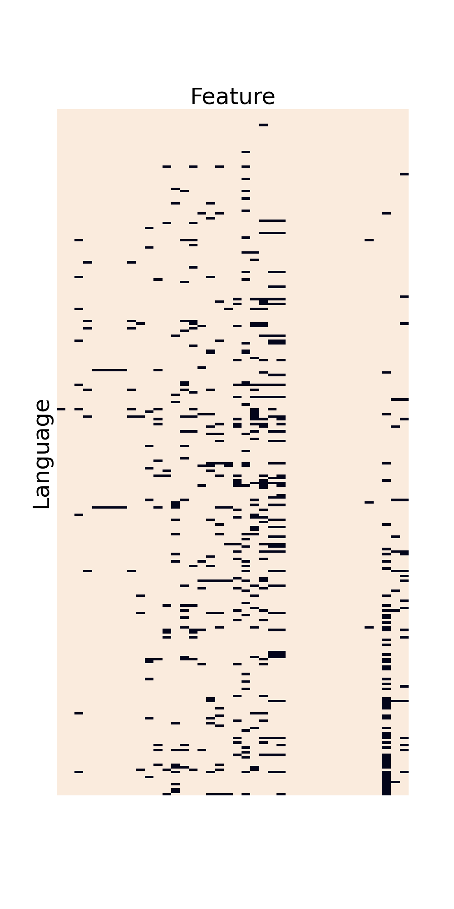

# SILS

SILS (Statistical Investigation of Language Structures) is a project
to apply machine learning methods to the [WALS dataset](https://wals.info/).
WALS compiles features of the world's languages from various published
grammars, showing how languages vary and the common patterns
found across many different languages.

This was my final project for [Lighthouse Labs](https://www.lighthouselabs.ca/en/).

## Background

The world's languages are quite diverse, but they aren't random;
certain language features are much more common than others,
and certain combinations of features tend to occur together.
This suggests that there are universal forces shaping languages,
either because of the way the human brain works, or because of
the practical needs of a communication system.

I've done two analyses on the WALS dataset to gain insight into these forces:

- Using hierarchical clustering to look for "parameters" that
  control multiple features at once.
- Using linear models to control for the historical and
  geographical relationships between languages and reveal the underlying tendencies.

## Data Preprocessing

The biggest challenge in using the WALS dataset is that it's very sparse.
While the dataset lists over 2,000 languages and 192 language features,
most of these languages are poorly documented and lack values for most
features. So I had to narrow my focus to the best documented languages
and features.

The whole dataset looks like this:

A language has a given feature documented in WALS only if its point is tan in this
plot. The black is all the missing data. Fortunately, the sparsity isn't random;
some languages are very well documented and have most of the features filled in,
while some features are commonly mentioned in the literature and have values filled in
for most languages. So I chose a sample of the best-documented languages and
restricted my analysis to the best-documented features.

The easiest way to do this is to keep only the M best languages and the
N best features, choosing M and N to achieve the desired density.
The problem is that some languages are "anomalously documented", in that
they have values for many poorly documented features but lack values
for many well-documented features. This means M and N have to be very
small to get a good enough density.

Instead, I iteratively eliminated the worst-documented feature and then
the two worst-documented languages, re-sorting the rows and columns by
density after every iteration, and continuing until a certain density
threshold was met. That way, "anomalously documented" languages
lose most of their features in the early iterations, and then are eliminated
themselves. After trying various thresholds, I settled on a sample
of 280 languages and 40 features. This is what the sample looks like:

This sample has a density of 95%, leaving the remaining 5% to be imputed.
This is much better than the naive approach of simply choosing the
best-documented 280 languages and 40 features independently of each
other, which only leads to an 85% density.

The resulting languages are still a good representation of the diversity
of the world's languages. Here they are on the map:

Note that each dot indicates the language's place of *origin*,
not the current extent of its speaker population. For example,
all those dots in Mexico are indigenous languages; none are Spanish, which
has one dot centred in Spain.

## Parameters

Noam Chomsky proposed that languages can be described
by a list of *parameters*, like switches that can be either
on or off, and these parameters control many of the
language's features. For example, languages can be
either "head-final" or "head-initial", and this single
switch affects verb placement, adjective placement, prepositions,
etc. Could I find evidence of this by clustering
languages by their features?

## 
