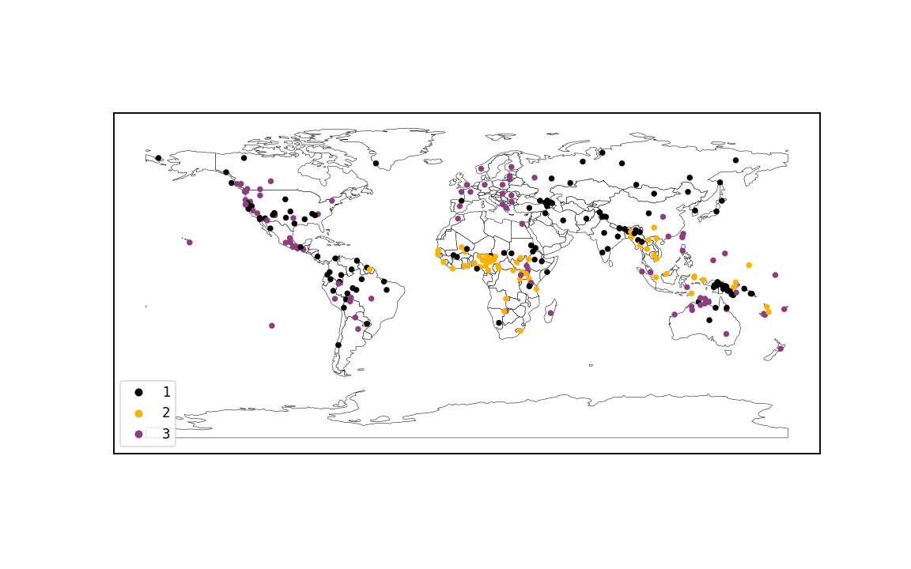
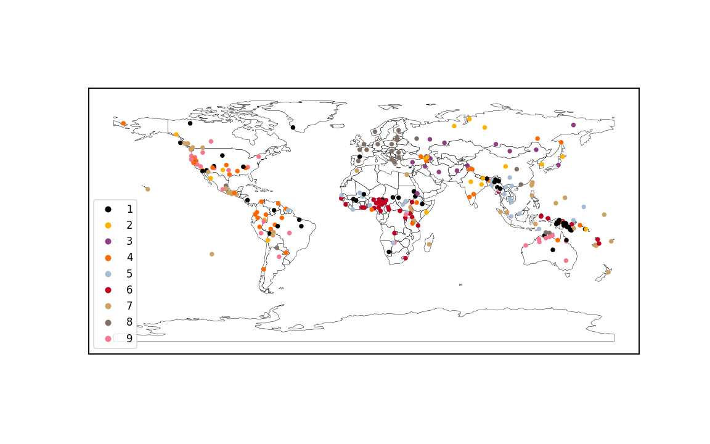

# SILS

SILS (Statistical Investigation of Language Structures) is a project
to apply machine learning methods to the [WALS dataset](https://wals.info/).
WALS compiles features of the world's languages from various published
grammars, showing how languages vary and the common patterns
found across many different languages.

This was my final project for [Lighthouse Labs](https://www.lighthouselabs.ca/en/).

## Overview

The world's languages are quite diverse, but they aren't random;
certain language features are much more common than others,
and certain combinations of features tend to occur together.
This suggests that there are universal forces shaping languages,
either because of the way the human brain works, or because of
the practical needs of a communication system.

I've done two analyses on the WALS dataset to gain insight into these forces:

- Using hierarchical clustering to look for "parameters" that
  control multiple features at once.
- Using linear models to control for the historical and
  geographical relationships between languages and reveal the underlying tendencies,
  i.e. how common we would expect a feature to be in a collection of totally
  independent languages.

These are the main takeaways from these analyses:

- The world's languages naturally cluster into two groups based on
  whether they tend to put the most important word (the "head") in a phrase
  at the beginning or the end of the phrase. This corresponds to the known
  classification of languages into "head-initial" and "head-final".
- The inferred underlying tendency towards certain features is quite different
  from the raw proportions. For example, *labial-velar* sounds (pronouncing
  a "k" and "p" or a "g" and "b" at the same time) occur in 6% of
  my sample, but the languages that have it are clustered in one region
  in sub-Saharan Africa and likely got it from a common source. My
  analysis implies that, in a collection of totally independent languages,
  labial-velar sounds would arise in only about 1% of them.

## Data Preprocessing

Data preparation is in ``prep.ipynb``.

### Choosing a Sample

The biggest challenge in using the WALS dataset is that it's very sparse.
While the dataset lists over 2,000 languages and 192 language features,
most of these languages are poorly documented and lack values for most
features. So I had to narrow my focus to the best documented languages
and features.

The whole dataset looks like this:

A language has a given feature documented in WALS only if its point is tan in this
plot. The black is all the missing data. Fortunately, the sparsity isn't random;
some languages are very well documented and have most of the features filled in,
while some features are commonly mentioned in the literature and have values filled in
for most languages. So I chose a sample of the best-documented languages and
restricted my analysis to the best-documented features.

The easiest way to do this is to keep only the M best languages and the
N best features, choosing M and N to achieve the desired density.
The problem is that some languages are "anomalously documented", in that
they have values for many poorly documented features but lack values
for many well-documented features. This means M and N have to be very
small to get a good enough density.

Instead, I iteratively eliminated the worst-documented feature and then
the two worst-documented languages, re-sorting the rows and columns by
density after every iteration, and continuing until a certain density
threshold was met. That way, "anomalously documented" languages
lose most of their features in the early iterations, and then are eliminated
themselves. After trying various thresholds, I settled on a sample
of 280 languages and 40 features. This is what the sample looks like:

This sample has a density of 95%, leaving the remaining 5% to be imputed.
This is much better than the naive approach of simply choosing the
best-documented 280 languages and 40 features independently of each
other, which only leads to an 85% density.

The resulting languages are still a good representation of the diversity
of the world's languages. Here they are on the map:

Note that each dot indicates the language's place of *origin*,
not the current extent of its speaker population. For example,
all those dots in Mexico are indigenous languages; none are Spanish, which
has one dot centred in Spain.

### Encoding

The features in WALS are all encoded as ordinal variables; e.g. if
a given feature has four different values, those values are assigned
the numbers 1 to 4. But most of the features don't really represent
ordered things. For example, Feature 88A ("Order of Demonstrative and
Noun") has these values:

- 1: Demonstrative, then noun
- 2: Noun, then demonstrative
- 3: Demonstrative prefix
- 4: Demonstrative suffix
- 5: Demonstrative both before and after noun
- 6: Mixed

The order here is arbitrary. Demonstrative followed by noun isn't
a more extreme version of noun followed by demonstrative, etc.
I one-hot encoded these, resulting in six binary columns.

Sometimes, the last (or the first!) value represents "the feature
is completely absent". Feature 69A ("Position of Tense-Aspect Affixes")
is an example of this:

- 1: Tense-aspect prefixes
- 2: Tense-aspect suffixes
- 3: Tense-aspect tone
- 4: Mixed type
- 5: No tense-aspect inflection

I still one-hot encoded these, but since value 5 is just
"not applicable", I used only four binary columns and
gave any language with value 5 a zero in all four columns.

Other features are actually composites of several independent
features that happen to fit in the same category. For example,
Feature 19A ("Presence of Uncommon Sounds") has these values:

- 1: None
- 2: Clicks
- 3: Labial-velars
- 4: Pharyngeals
- 5: 'Th' sounds
- 6: Clicks, pharyngeals, and 'th'
- 7: Pharyngeals and 'th'

Since this is really four different features (clicks,
labial-velars, pharyngeals, 'th' sounds), I used
four binary columns, and gave languages with mixed types
ones in multiple columns.

After encoding, I removed any columns with no variation,
i.e. where all 280 languages had the same value in that
column. Such columns represent features that are so
rare that they aren't found in any of the 280 languages of the
sample, and so were unusable for this analysis.

Encoding in this way turned the 40 features into
118 feature columns.

### Scaling

Since I wanted to use distance-based algorithms to analyze
the language features, I scaled each feature column
to range between 0 and 1. This was already the case for
the binary columns, but the remaining ordinal columns had
to be forced between 0 and 1 as well.

For example,
Feature 1A ("Vowel Inventories") has the values:

- 1: Small
- 2: Moderately small
- 3: Average
- 4: Moderately large
- 5: Large

After scaling, these values became:

- 0.00: Small
- 0.25: Moderately small
- 0.50: Average
- 0.75: Moderately large
- 1.00: Large

### Imputing

The last preprocessing step was to fill in missing values.
I used a k-nearest neighbours imputer to accomplish this,
effectively filling in missing values by looking at the
languages that were most similar otherwise.
This left some binary features with values between 0 and 1
(if the most similar languages had different values for the
feature), indicating some uncertainty as to which value
was correct.

## Parameters

The analysis of linguistic parameters by clustering is
in ``cluster.ipynb``.

Noam Chomsky proposed that languages can be described
by a list of *parameters*, like switches that can be either
on or off, and these parameters control many of the
language's features. For example, languages can be
either "head-final" or "head-initial", and this single
switch affects verb placement, adjective placement, prepositions,
etc. Could I find evidence of this by clustering
languages by their features?

I used the ``scipy.cluster.hierarchy`` module from
SciPy to do the hierarchical clustering and draw
dendrograms of the results. I measured distances
between languages with the Euclidean metric and
distance between clusters using the Ward method.

The first step was to establish a baseline to make sure
the results I was getting weren't just spurious patterns in
noise. I created a baseline dataset by shuffling each
feature column separately, resulting in each language having
random features but each feature occurring at the observed
frequency overall. The result of the hierarchical clustering
looked like this:

On the real dataset, the result of the hierarchical clustering
looked like this:

### Two Clusters

Thie above diagram suggests a natural division of the world's languages into two
groups:

We can see striking regional patterns here: languages in
South America, New Guinea, and most of Asia are overwhelmingly
in group 1, while languages in Europe, Africa,
Southeast Asia, and the Pacific islands are overwhelmingly in group 2.

What distinguishes these two groups? These are the top ten
most distinct feature columns, measured by how different
the average value of the feature column is between the two
groups:

| Feature Column | Feature Description | Cluster 1 Average | Cluster 2 Average | Difference |
| --- | --- | --- | --- | --- |
| 81A_1 | The components of a clause are ordered Subject-Object-Verb (SOV) | 0.90 | 0.01 | 0.89 |
| 83A_1 | The verb's object goes before the verb | 0.93 | 0.05 | 0.88 |
| 83A_2 | The verb's object goes after the verb | 0.03 | 0.83 | 0.80 |
| 85A_1 | The language has postpositions | 0.91 | 0.14 | 0.77 |
| 85A_2 | The language has prepositions | 0.03 | 0.69 | 0.66 |
| 86A_1 | Possessives go before the noun they possess | 0.92 | 0.27 | 0.65 |
| 90A_1 | Relative clauses go after the noun they describe | 0.30 | 0.88 | 0.57 |
| 81A_2 | The components of a clause are ordered Subject-Verb-Object (SVO) | 0.04 | 0.56 | 0.52 |
| 86A_2 | Possessives go after the noun they possess | 0.05 | 0.56 | 0.51 |
| 69A_2 | Verb tense is marked by suffixes | 0.82 | 0.37 | 0.46 |

These clusters have names in linguistic typology; cluster 1 is
"head-final" and cluster 2 is "head-initial". English is an example
of a cluster 2 (head-initial) language. Take the following sentence:

> The man who lives in the basement ate the student's soup.

This sentence shows the following features of English:

- The object "the student's soup" goes after the verb "ate" (like 83% of cluster 2 languages)
- English uses prepositions: "in" goes before "the basement" (like 69% of cluster 2 languages)
- The possessive "student's" goes before the noun it possesses, "soup" (like 27% of cluster 2 languages)
- The relative clause "who lives in the basement" goes after the noun it describes, "man" (like 88% of cluster 2 languages)

Of these features, only the position of the possessive is atypical of
cluster 2 languages.

(In fact, English has a zero value for both "possessive before noun" and
"possessive after noun" because it vacillates between the two orders,
depending on how animate the possessor is. You can say either
"the student's soup" or "the soup of the student"; the former is
preferred, but the preference reverses in "the soup of the day")

In contrast, if we translated the above sentence into Japanese, a
prototypical cluster 1 language, it would have a structure more like this:

> The basement in living man the student's soup ate

In Japanese:

- The object goes before the verb (like 93% of cluster 1 languages)
- Postpositions are used: "in" goes after "the basement" (like 91% of cluster 1 languages)
- The possessive goes before the noun it possesses (like 92% of cluster 1 languages)
- The relative clause goes before the noun (only 30% of cluster 1 languages have it after)

The central idea here is that cluster 1 languages tend to put the "most important"
word in a phrase (the "head") at the end of the phrase, while the cluster
2 languages tend to put it at the beginning.

It's encouraging to see this known classification of languages into head-final
and head-initial emerge from clustering on language features.

### Three Clusters

The next most natural classification is into three groups, with the original
cluster 2 being split into two subgroups. This is what these groups look like:

This effectively splits the head-initial languages into the African type (yellow) and
the European/American type (purple). The most distinguishing features between these
two clusters are:

| Feature Column | Feature Description | African-type Average | European-type Average | Difference |
| --- | --- | --- | --- | --- |
| 89A_2 | Numerals come after the noun | 0.84 | 0.13 | 0.71 |
| 81A_2 | The components of a clause are ordered Subject-Verb-Object (SVO) | 0.95 | 0.29 | 0.66 |
| 82A_1 | The subject of a clause goes before the verb | 1.00 | 0.34 | 0.66 |
| 89A_1 | Numerals come before the noun | 0.16 | 0.82 | 0.65 |
| 88A_2 | Demonstratives come after the noun | 0.88 | 0.26 | 0.63 |
| 88A_1 | Demonstratives come before the noun | 0.03 | 0.66 | 0.62 |
| 93A_1 | Question words go at the beginning of the sentence | 0.10 | 0.63 | 0.53 |
| 93A_2 | Question words replace the noun in the sentence | 0.82 | 0.30 | 0.52 |
| 92A_2 | Question particles go at the end of the sentence | 0.61 | 0.11 | 0.50 |
| 143A_1 | Negative markers go before the verb | 0.39 | 0.85 | 0.47 |

The common thread here seems to be "prototypical" head-initial languages
versus "atypical" head-initial languages. The prototypical head-initial
language has SVO word order and everything coming after the noun in a noun
phrase, which is more common in the African type. The European/American type is more
likely to mix things up by having flexible word order in clauses, or
putting numerals and demonstratives before nouns, or moving the question
word to the beginning of the sentence.

### More Clusters

As we move down the clustering hierarchy to make finer and finer groups,
the results tend to dissolve into noise. Here's the map at nine clusters:

The interesting thing to note here is that, even now that the map looks
more chaotic, all the languages of Europe (except Basque) are still
in the same cluster. This underscores how little you can learn about
the way language works in general by studying only European languages!

## Underlying Tendencies

The analysis of underlying tendencies using linear models is
in ``origins.ipynb``.

The features in different languages aren't independent from
each other: languages in the same family are likely to share
features because of their common origin, while languages
in close geographical proximity tend to become more like each
other over time. When seeking the underlying forces that shape
language features, these relationships
are a distraction. Can we control for them?

My approach was to model language features as caused by three
factors: language family, geographical region, and some
innate tendency to favour having or not having the feature.
So I fit linear models to predict each language feature, with coefficients for
each language family and geographical region. The model's intercept
represents what's left over: the innate tendency.

### Language Family

The WALS dataset lists a "family" and "genus" for each language.
Families in this context refers to the largest known groups
of languages that can be demonstrated to have a common origin,
while genera are smaller groups of languages whose common origin
is obvious.
For example, the Romance languages (those descended from
Latin, like French and Spanish) are considered a genus;
their family is the Indo-European family, which also includes
languages like German, Russian, and Hindi.

Some families and genera are only represented by one or two
languages in the sample, which makes them unhelpful for modelling.
I kept only the groups that had at least five
representatives in the sample. This left the following list
of groups:

| Group Name | Group Level | Number of Languages in the Sample |
| --- | --- | --- |
| Austronesian | Family | 26 |
| Niger-Congo | Family | 23 |
| Indo-European | Family | 20 |
| Afro-Asiatic | Family | 15 |
| Sino-Tibetan | Family | 15 |
| Trans-New Guinea | Family | 11 |
| Altaic | Family | 8 |
| Austro-Asiatic | Family | 6 |
| Uto-Aztecan | Family | 6 |
| Eastern Sudanic | Family | 6 |
| Nakh-Daghestanian | Family | 5 |
| Penutian | Family | 5 |
| Pama-Nyungan | Family | 5 |
| Oceanic | Family | 13 |
| Bantoid | Family | 6 |

Note that some of these families are dubious (e.g. Altaic and Penutian)
but they still reflect some degree of geographical relationship,
so I kept them.

### Geographical Region

### Logistic Regressions

### Linear Regressions

### Combined Results

